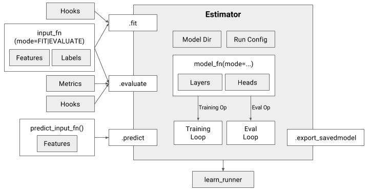

# Best practices in TensorFlow (how to use the Estimator and Experiments API)

## What

[TensorFlow](https://www.tensorflow.org/) allows (relatively) easy creation and
optimisation of computational graphs for a practically unlimited range of 
tasks. For each of these tasks, however, one needs:

+ An input pipeline
+ A model specification
+ A training loop
+ An evaluation loop
+ Metrics
+ ...hundreds of other things but I think the point is clear.

Implementing and training a machine learning model requires substantial 
engineering effort which typically rests on the model designer. It is often 
(read: always) a challenge, and slightly mind-numbing, to implement each of the 
above components every time you want to just train a model. In addition, it is 
empirically almost impossible to do this in a bug-free manner for even 
moderately complex models.

Image taken from https://arxiv.org/abs/1708.02637

Image taken from https://arxiv.org/abs/1708.02637

## References

### Blog posts

+ Great introductory post by Peter Roelants [Higher-Level APIs in TensorFlow](https://medium.com/onfido-tech/higher-level-apis-in-tensorflow-67bfb602e6c0).

### Papers

+ Cheng, H.-T. et al. (2017). 
TensorFlow Estimators: Managing Simplicity vs. Flexibility in High-Level Machine Learning Frameworks. 
  + DOI: https://doi.org/10.1145/3097983.3098171 
  + arXiv: http://arxiv.org/abs/1708.02637
